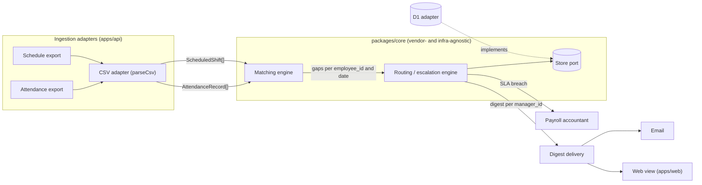

# Architecture

## High-level flow

Attendance and schedule exports enter through an ingestion adapter —
one generic CSV adapter today, vendor-specific ones per employer later.
It normalizes both into one common schema, which feeds:

1. **Ingestion layer** — normalizes any source into one internal schema.
2. **Matching engine** — compares clock entries vs. schedule, per
   employee_id + date.
3. **Routing/escalation engine** — groups by manager_id, tracks SLA
   timers.
4. **Digest delivery** — email/web view at launch, WhatsApp later.



Schema, matching algorithm, and routing/escalation logic are in
`core-design.md`.

## Ingestion layer — vendor-agnostic by design

The only thing that changes per employer is the **adapter** at the input.
The core (matching + routing) never depends on the vendor.

- **First implementation:** a plain function `parseCsv(text)` returning
  `{ shifts: ScheduledShift[], records: AttendanceRecord[] }`, used for
  both attendance and schedule exports (most systems export CSV). No
  adapter interface yet — it is extracted when the second adapter is
  written (ADR-0003).
- **When a new employer is known** — write a specific adapter for
  whatever they actually provide (Excel/PDF/API/etc.), without touching
  the rest of the code; add its format to `imports.source` then.
  Adapters get added as the need for them shows up, not ahead of time.

## Repo layout

Monorepo managed with Turborepo, standard `apps/*` / `packages/*`
workspace convention. Backend and frontend are separate apps, not one
merged app — see ADR-0002. Package boundaries — see ADR-0003:

```text
packages/core     domain types, matching engine, routing/escalation,
                  the Store port, synthetic fixtures.
                  No runtime/framework imports (enforced by ESLint).
apps/api          Hono: routes, cron entry point, and all adapters
                  (src/adapters/{store-d1, csv, email}). Wires adapters
                  into core by hand.
apps/web          Vue 3 + Tailwind 4: digest page, resolve action.
```

Adapters are not separate packages until a second implementation of
one actually exists (e.g. a Postgres `Store` at migration time).

## Frameworks

- Backend: Hono.
- Frontend: Vue 3, Tailwind 4.

Rationale and alternatives considered: ADR-0002.

## Infra-agnostic core

Same principle as the vendor-agnostic ingestion adapter, applied to
infrastructure: the matching engine, routing/escalation logic, and the
daily digest job are plain functions with no Cloudflare/D1-specific
calls inline. Data access goes through a `Store` interface (one
implementation per backend); see ADR-0001 for the full rationale and
what changes on migration. `Store` is the core's only port — time is
passed in as a `now` argument, and notification/CSV parsing are plain
functions in `apps/api` (ADR-0003). The D1 `Store` implementation uses
Drizzle, so the same schema definition targets SQLite now and Postgres
after migration (ADR-0001); `drizzle-orm` is banned from `packages/core`
(ADR-0003).
