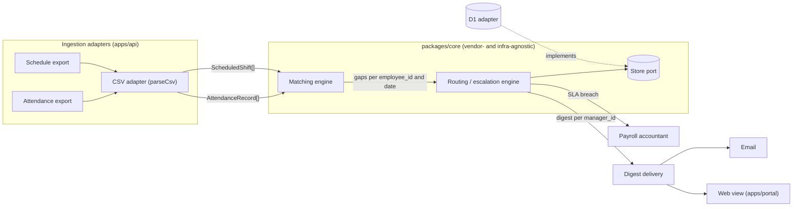

# Architecture

## High-level flow

Attendance and schedule exports enter through an ingestion adapter —
one generic CSV adapter today, vendor-specific ones per employer later.
It normalizes both into one common schema, which feeds:

1. **Ingestion layer** — normalizes any source into one internal schema.
2. **Matching engine** — compares clock entries vs. schedule, per
   employee_id + date.
3. **Routing/escalation engine** — groups by manager_id, tracks SLA
   timers.
4. **Digest delivery** — email/web view at launch, WhatsApp later.



Schema, matching algorithm, and routing/escalation logic are in
`core-design.md`.

## Ingestion layer — vendor-agnostic by design

The only thing that changes per employer is the **adapter** at the input.
The core (matching + routing) never depends on the vendor.

- **First implementation:** a plain function `parseCsv(text)` returning
  shifts and records from one file format
  (`employee_id,date,planned_start,planned_end,clock_in,clock_out` — a
  row with planned times is a shift, with clock times a record, or
  both). No adapter interface yet — it is extracted when the second
  adapter is written (ADR-0003).
- **Sources:** both files arrive either as an upload (console or
  `scripts/upload.ts`) or, when `employers.import_url` / `roster_url`
  are set, fetched daily by the cron before the digest
  (`core-design.md` § Scheduled import). A local folder cannot be
  reached from Workers; for that, the operator's own scheduler runs
  `scripts/upload.ts`.
- **Roster:** employees and their managers come from a second CSV
  (`employee_id,employee_name,manager_id,manager_name,manager_email`),
  upserted by external id. Re-uploading it is how a reassignment is
  recorded; gaps already detected keep their manager snapshot, and the
  open gaps of an employee missing from the new file stay open. A gap
  whose type changes on a later import (`no_record_at_all` →
  `no_clockout`, say) stays the same gap with the same SLA timer.
- **Endpoints** (`apps/api`): upload endpoints for scripts and
  schedulers — `POST /employers/:id/roster`, `POST /employers/:id/imports`
  (runs detection for the dates in the file) — behind a **per-employer
  API key** the operator issues in the console (ADR-0007; Settings →
  API keys: shown once, stored as a SHA-256 hash, revocable, last use
  recorded; the key decides the employer and must match the path); and
  `GET /health`. The cron trigger (08:00 UTC) runs, per employer:
  scheduled import from the configured URLs (https only, no redirects,
  no literal-IP or localhost hosts, 10 MB cap — ADR-0007), digests
  (send, mark notified, save the digest — in that order), then
  escalations (recorded after the email sends, so at-least-once).
- **Email** goes out through `SendEmail`, a plain function in
  `src/adapters/email.ts` whose only implementation today calls Resend
  (`RESEND_API_KEY`). Two-way door: another provider is a second
  implementation of the same function.
- **Manager access** (ADR-0004): the digest email carries a signed,
  expiring link scoped to that manager (`<WEB_URL>/d/<token>`).
  `GET /d/:token` returns that manager's open gaps with employee names,
  shift and clock times, notification time and escalation state, plus
  their team's unscheduled attendance for the last 14 days;
  `POST /d/:token/gaps/:gapId/resolve` (`outcome` present|absent; `note`
  required for absent) runs `resolveByManager`. Tokens are HMAC-SHA-256 over
  `{employerId, managerId, exp}` with `LINK_SECRET`, valid 14 days.
  CORS on `/d/*` is open to `WEB_URL` only. No accounts or sessions.
- **Contact form**: `POST /contact` from the site (`SITE_URLS` origins
  only) — validated, honeypot field, size-capped — emails
  `CONTACT_EMAIL` with the sender as reply address. No auth, no storage.
- **Payroll accountant's access** (ADR-0004 § extended): each
  escalation email links to `/e/<token>` (one gap, `kind: "payroll"`,
  14 days); `GET /e/:token`
  shows it, `POST /e/:token/handle` closes it with `outcome` + `note`
  (`resolution = payroll_action`). CORS as for `/d/*`.
- **Operator console** (ADR-0005, amended): `POST /console/login`
  (60 s per-address cooldown) emails a 15-minute single-use link token
  to `employers.operator_email`, in the URL fragment of a link on
  `CONSOLE_URL`; the page exchanges it at `POST /console/exchange` for
  a 7-day session token (used link tokens are recorded in
  `used_link_tokens`). CORS on `/console/*` is open to that origin only.
  The browser keeps the session token in `sessionStorage` and sends it
  as a bearer to
  `GET /console/me`, `PATCH /console/employer`, `POST /console/roster`,
  `POST /console/imports`, `GET /console/imports`,
  `POST /console/imports/run` (fetch the configured URLs now),
  `GET /console/resolutions.csv?from&to` (corrections export),
  `GET /console/overview`.
  `GET/POST /console/api-keys`, `DELETE /console/api-keys/:id`.
  Tokens carry `kind: "operator"`, so a manager's digest token is never
  accepted there and vice versa.
- **Owner admin area** (ADR-0006, `admin.clockcover.com`, `ADMIN_URL`):
  `POST /admin/login` emails a link token to `ADMIN_EMAIL` only, which
  `POST /admin/exchange` turns into a 7-day `kind: "admin"` session
  token, as for the console; bearer to `GET /admin/me`, `GET /admin/employers`
  (headcount, managers, operator, open/escalated gaps, last import),
  `POST /admin/employers` (create + email the operator a console invite),
  `PATCH /admin/employers/:id` (re-invites when the operator changes),
  `POST /admin/employers/:id/invite`. CORS to `ADMIN_URL` only.
- **When a new employer is known** — write a specific adapter for
  whatever they actually provide (Excel/API/etc.), without touching
  the rest of the code; add its format to `imports.source` then. The
  enum already reserves `excel`; no Excel adapter exists yet, and every
  import today is `csv`. Adapters get added as the need for them shows
  up, not ahead of time.

## Repo layout

Monorepo managed with Turborepo, standard `apps/*` / `packages/*`
workspace convention. Backend and frontend are separate apps, not one
merged app — see ADR-0002. Package boundaries — see ADR-0003:

```text
packages/core     domain types, matching engine, routing/escalation,
                  the Store port, synthetic fixtures.
                  No runtime/framework imports (enforced by
                  tests/boundary.test.ts).
apps/api          Hono: routes, cron entry point, and all adapters
                  (src/adapters/{store-d1, csv, email}). src/index.ts
                  is the only file that knows about Workers bindings;
                  src/app.ts takes every dependency as an argument so
                  tests run it on libsql with a fake mailer. Routes by
                  audience: src/console.ts (operator), src/admin.ts
                  (owner), src/api-keys.ts (per-employer upload keys);
                  src/link.ts signs and verifies every token kind;
                  src/import-run.ts fetches and imports from the
                  configured URLs; src/i18n.ts is the email dictionary.
apps/portal       Vue 3 + Tailwind 4 (Vite). One worker, three hosts:
                  https://portal.clockcover.com — /d/:token the manager's
                  digest page (ADR-0004), /e/:token the payroll
                  accountant's page; https://console.clockcover.com —
                  the operator console at the host root (ADR-0005);
                  https://admin.clockcover.com — the owner's employer
                  list and onboarding, also at the root (ADR-0006).
                  /console/... paths are only a fallback on other
                  hosts. View logic in
                  src/*.ts, API clients in src/*-api.ts; VITE_API_URL →
                  https://api.clockcover.com, VITE_CONSOLE_URL → console.
apps/web          Marketing website: static HTML + CSS served as
                  Worker assets, in English (/) and Hebrew (/he/):
                  front page (early access, pricing), Help (file
                  formats, cases, FAQ), Integrations (what exists,
                  what we build, what we need, the two-week process),
                  About, Get in touch (a form posting to the API's
                  /contact). No framework, no build, no dependency on
                  core.
```

**Languages** (ADR-0008). Copy lives in two dictionaries — `apps/api/src/i18n.ts`
(emails, dates) and `apps/portal/src/i18n.ts` (pages) — keyed the same
way in `en` and `he`; the employer's `locale` selects one, `he` renders
right-to-left (`dir="rtl"` on emails and `<html>`), and the Heebo face
supplies Hebrew glyphs next to Schibsted Grotesk. The site is static pages
under `/` and `/he/`, cross-linked with `hreflang`; a one-function Worker
in front of the assets sends a browser whose `Accept-Language` prefers
Hebrew from the bare `/` to `/he/` (302, `Vary: Accept-Language`;
`/?lang=en` opts out). The language link itself lives in the footer.
Dates are formatted by hand in both languages (weekday, day, month) so
emails and pages agree. Adding a language is a third column in the two
dictionaries.

The visual design of the emails, the digest page and the site is the
"ClockCover notification system" project in Claude Design; the code
mirrors its artboards (fonts Schibsted Grotesk / Fragment Mono, the
oklch palette in `apps/portal/src/style.css` and `apps/web/public/styles.css`,
hex equivalents in the email templates).

Adapters are not separate packages until a second implementation of
one actually exists (e.g. a Postgres `Store` at migration time).

## Frameworks

- Backend: Hono.
- Frontend: Vue 3, Tailwind 4.

Rationale and alternatives considered: ADR-0002.

## Infra-agnostic core

Same principle as the vendor-agnostic ingestion adapter, applied to
infrastructure: the matching engine, routing/escalation logic, and the
daily digest job are plain functions with no Cloudflare/D1-specific
calls inline. Data access goes through a `Store` interface (one
implementation per backend); see ADR-0001 for the full rationale and
what changes on migration. `Store` is the core's only port — time is
passed in as a `now` argument, and notification/CSV parsing are plain
functions in `apps/api` (ADR-0003); digest delivery is passed in as a
`send` function. The D1 `Store` implementation uses
Drizzle, so the same schema definition targets SQLite now and Postgres
after migration (ADR-0001); `drizzle-orm` is banned from `packages/core`
(ADR-0003).
